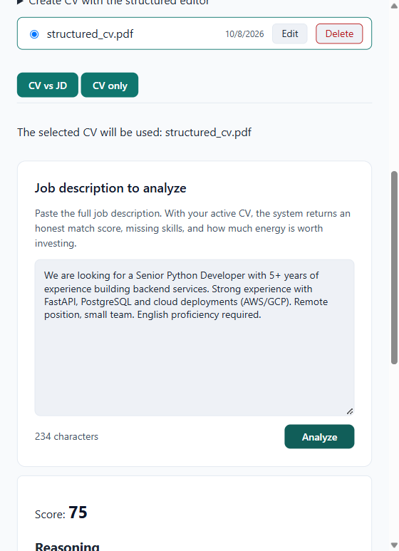

# AsistCV

[](https://github.com/danielCH26/asistcv/actions/workflows/ci.yml)
[](LICENSE)

> **Aplicá mejor, no más.** AsistCV analiza honestamente qué tan bien encaja tu CV con una búsqueda de empleo, te dice qué te falta y cuánta energía vale la pena invertir — antes de que gastes una hora reescribiendo tu CV para un puesto que no era.



## Qué hace

Pegás la descripción de un puesto, elegís tu CV, y el sistema devuelve un **score honesto de match** con razones, skills faltantes y la energía recomendada. Para los puestos que pasan el filtro, **reescribe los bullets de tu CV** contra esa descripción — sin inventar experiencia: un validador anti-alucinación rechaza cualquier skill o logro que no esté en tu CV original, y vos aprobás antes de enviar.

Diseñado para ayudar a aplicar mejor a los **5–10 puestos que valen la pena**, no a auto-aplicar a 100. El anti-patrón explícito del producto: no auto-applier, no inventa experiencia, no chatbot mágico.

## Por qué importa

El documento fundacional ([`job-search-assistant.md`](job-search-assistant.md)) resume el problema: postularse a un puesto a mano toma ~15 minutos entre leer la búsqueda y ajustar el CV; la mayoría de esas aplicaciones van a puestos donde el candidato no encaja. AsistCV reduce la evaluación a **segundos** con un score honesto y concentra el esfuerzo humano donde hay señal. Las métricas reales del proyecto están en [`docs/metrics.md`](docs/metrics.md).

## Verlo correr

El producto está en producción con stack 100% free tier (sin tarjeta de crédito):

- **Frontend**: https://asistcv-frontend.pages.dev
- **Backend**: https://asistcv-backend.onrender.com (`/health` responde `{"status":"ok"}`)

## Correrlo localmente

### Prerequisitos

- Python 3.12+ con [uv](https://docs.astral.sh/uv/)
- Node.js 20+ con npm
- Docker y Docker Compose (para la DB local con pgvector)

### Backend

```bash
cd backend
cp .env.example .env        # editá los valores que necesites
uv sync --extra dev         # IMPORTANTE: sin --extra dev perdés pytest/ruff/mypy
docker compose up -d        # DB local con pgvector
uv run alembic upgrade head
uv run uvicorn app.main:app --reload
```

En dev el default es `LLM_PROVIDER=mock` + `EMBEDDING_PROVIDER=mock` (vectores deterministas, sin API keys). Para LLM real: `LLM_PROVIDER=groq` + `GROQ_API_KEY` + `EMBEDDING_PROVIDER=gemini` + `GEMINI_API_KEY` (gratis, sin tarjeta).

### Frontend

```bash
cd frontend
npm install
npm run dev
```

### Tests

```bash
cd backend && uv run pytest -q          # ~590 tests
cd frontend && npm run test             # ~112 tests
```

## Stack

| Capa | Herramienta |
|---|---|
| Backend | FastAPI (Python 3.12, uv) |
| Frontend | SvelteKit (TypeScript, npm) |
| MCP Adapter | Python con SDK `mcp` oficial |
| DB | PostgreSQL + pgvector (Neon en prod, docker local) |
| Deploy | **Render** (backend, manual deploy) + **Cloudflare Pages** (frontend) |
| LLM | Groq (razonamiento del match/adaptación) |
| Embeddings | `gemini-embedding-001` vía Gemini API — free tier, sin tarjeta |

El detalle de cada decisión (por qué esta herramienta y no la alternativa, con la historia de los pivotes) está en [`STACK.md`](STACK.md). El plan de releases está en [`ROADMAP.md`](ROADMAP.md).

## Roadmap

- **v1.0 — MVP Early Adopters** ✅: match + adaptación en producción, RLS, rate limiting, design system v2 (teal + clay)
- **v2.0 — Lanzamiento público** (dic 2026): landing, pasarela Colombia (PSE), cron de ofertas, monitoreo

Ver [`ROADMAP.md`](ROADMAP.md) para el detalle.

## Métricas

Las métricas primarias y secundarias del documento fundacional, con números reales y análisis honesto: [`docs/metrics.md`](docs/metrics.md).

## Contribuir

Issues y PRs bienvenidos. Para cambios de código:

1. Branch desde `main` (`feat/<nombre>`)
2. Los tests corren en CI y bloquean el merge — `pytest` + `ruff` + `mypy` en backend, `vitest` + `svelte-check` en frontend
3. El validador anti-alucinación (`adaptation_validator.py`) es la salvaguarda del producto: sus tests bloquean cualquier cambio que permita inventar skills

Los docs del repo (ROADMAP, STACK, métricas) están en español; el código, los commits y los tests en inglés.
